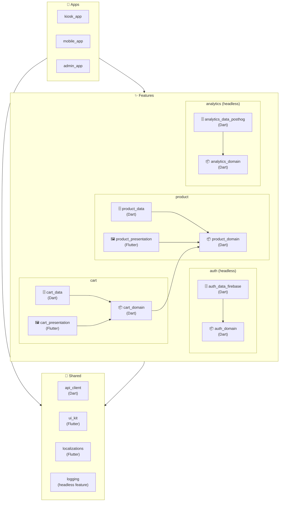
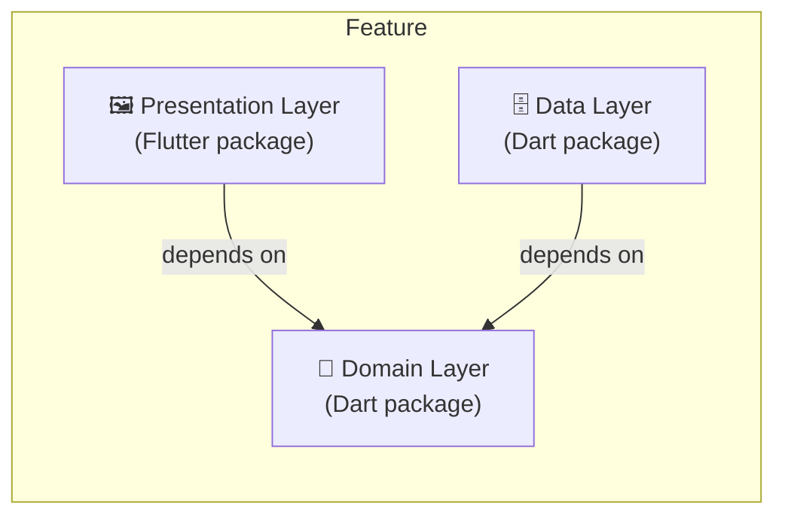
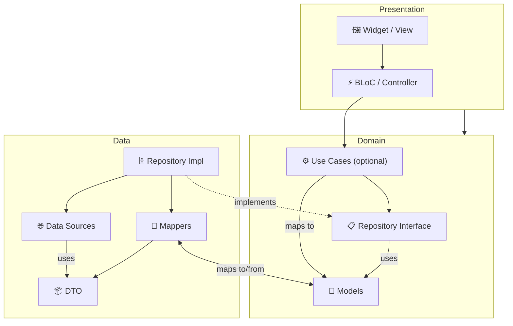

# Feature-First Clean Architecture (FFCA)

> Source of truth: https://www.notion.so/verygoodventures/Feature-First-Clean-Architecture-2fb45eb3279580568023d1cf9bc00c24
> This file is the in-plugin mirror, regenerated by `scripts/sync_reference.dart`. Do not edit by hand.

> **This architecture is designed for:**
> - Flutter projects using AI-assisted development
> - Monorepos with multiple apps sharing features
> - Teams organized around feature ownership
> - Projects where features need to be added/removed per app
> - Codebases that need to scale predictably

> **Consider standard VGE [Layered Architecture](https://engineering.verygood.ventures/development/architecture/architecture/) when:**
> - You have a single app with fewer than 3 features
> - You're not using AI-assisted development and the package overhead isn't justified
> - Features will never be shared across apps or teams
>
> That said, if you're using AI tools, the package overhead is near-zero (AI generates it), and the structural boundaries improve AI output quality. Consider starting with FFCA even for smaller projects.

## Goals

- **AI-First Architecture:** well-bounded packages give AI agents deterministic targets, reducing errors and making output consistent regardless of model or prompt
- Enable teams to ship features independently without waiting on other teams
- Establish ownership models for shared code
- Allow features to be reused in different apps. For example, you could build a feature and use it for a *point of sale* app, a *mobile* app, and an *admin* app.
- Reduce friction when multiple teams touch the same codebase
- Address shortcomings of current VGV architectural approaches: multiple blocs needing to perform the same data transformations, and the ability to share functionality across different blocs easily
- Ensure no circular dependencies (addressed by tooling)

## Non-Goals

- Convince enterprise orgs to change their structure
- Define team topology or ways of working
- Solve all cross-department communication challenges

## The Structure

Each project contains three major parts in a monorepo workspace:

1. apps
2. features
3. shared libraries



### Apps

The deployable applications. In a large codebase, you might have several apps, such as a *kiosk* app, an *admin* app, and a *mobile* app.

In this architecture, the responsibility of the app is rather limited. They compose a series of features and shared libraries to build a complete, deployable artifact usable by the target audience.

Each app defines its own routing structure, environment configurations, bundle ids, and CI/CD workflows for verification and deployment.

### Features

A feature is a cohesive unit of functionality. Some features have screens, some don't. Every feature follows clean architecture with domain, data, and (optionally) presentation layers as separate packages.

A feature with all three layers (domain + data + presentation) owns user-facing flows. For example, an e-commerce app may have a `Product` or `Cart` feature, to display a Product Screen or Shopping Cart.

#### Headless Features

A feature without a presentation layer is a **headless feature**. It provides business logic and data access consumed by other features but owns no screens. Common examples include `auth`, `analytics`, and `user_profile`.

A headless feature can grow into a full feature by adding a presentation layer package. For example, `auth` starts as a headless feature (domain + data), and when a login screen is needed, adding `auth_presentation` makes it a full feature. No structural changes to the existing packages are required.

### Shared Libraries

Applications and features may require common, shared libraries to achieve their goals. For example, many features may need a Swagger-generated `api_client` to perform HTTP requests, or a `ui_kit` (aka design system) for common widgets. Rather than each feature defining their own `api_client`, we can use a shared library across all features.

The distinction between shared libraries and features can be a bit fuzzy. A good rule of thumb: shared code should have zero knowledge of your app's features. Shared libraries never import from a feature folder, and their API makes sense without any feature-specific context. If you find yourself referencing a particular feature from shared, that code likely belongs in the feature instead.

Business-domain packages like `auth`, `analytics`, and `user_profile` are features (often headless), not shared libraries. They represent business decisions: which auth provider to use, which analytics events to track, what user data to store. Different apps have different backends. For example, some apps may use Firebase Auth while others use Auth0. Some apps may use Google Analytics while others use PostHog.

Infrastructure packages like `logging` and `secure_storage` can be either shared libraries (if generic enough for any project) or headless features (if customized for the project). A generic `ILogger` interface with a Sentry implementation belongs in `shared/`. A project-specific analytics setup with custom events belongs in `features/`.

The decision rule: **is it a business capability that apps compose?** If yes, it belongs in `features/`. **Could you publish it to pub.dev and someone else would use it unchanged?** If yes, it belongs in `shared/`.

| Component | Shared? | Why? |
|---|---|---|
| `PrimaryButton` | ✅ YES | It is part of the brand design system; agnostic of what it clicks. |
| `LoginButton` | ❌ NO | It implies a "Login" domain concept. Put it in `auth_presentation`. |
| `DioClient` | ✅ YES | It wraps generic HTTP logic (interceptors, timeouts). |
| `ProductApiClient` | ❌ NO | It knows about "Products" and API endpoints. Put it in `product_data`. |
| `formatCurrency()` | ✅ YES | Formats a double to string. Generic. |
| `calculateTax()` | ❌ NO | Tax rules are volatile business logic. Put it in `cart_domain` or `checkout_domain`. |

## Naming Conventions (Enforced)

Consistent naming enables tooling inference, AI comprehension, and mechanical validation.

| Package | Convention | Example |
|---|---|---|
| Feature domain | `{feature}_domain` | `cart_domain` |
| Feature data | `{feature}_data` | `cart_data` |
| Feature presentation | `{feature}_presentation` | `cart_presentation` |
| Data with specific backend | `{feature}_data_{backend}` | `auth_data_firebase` |
| Shared package | descriptive name | `ui_kit`, `api_client` |

Data packages with a backend suffix (e.g., `auth_data_firebase`) signal the backing implementation. Swapping to `auth_data_auth0` requires no structural changes.

## Feature Layers

Each feature is made up of 3 layers: the *domain* layer, the *data* layer, and the *presentation* layer, following the practices of [clean architecture](https://blog.cleancoder.com/uncle-bob/2012/08/13/the-clean-architecture.html). Each of these layers is an individual Dart or Flutter package.



### Domain Layer

The heart of the application. This layer is pure Dart, and entirely separate from "the outside world" of Flutter or concrete data sources, such as Firebase or http APIs. The domain layer defines the business models and operations of the given problem space, as well as the repositories required to perform those operations.

#### Models

Models, sometimes called "entities," are objects that contain the information you are trying to represent in the problem space. For example, in the context of an e-commerce app, the domain models might include a `Product` and a `Cart`. A `Product` class contains `id`, `title`, and `description` information.

Do not add the word `Model` or `Entity` to this class. This is the core of the domain, and it should be easy to read and understand.

#### Business Rules

There are generally two types of rules in the domain space: commands and queries. *Commands* make modifications to the domain models and often store them in a data source. *Queries* retrieve domain models from a data source. Combined, these are often referred to as "use cases." We recommend avoiding the term "use case" and instead prefer "Command" and "Query" classes for clarity. For example:

- `UpdateProductTitleCommand`: updates the title of a product and stores it in the data source.
- `GetProductByIdQuery`: fetches product information based on the product id. It returns a `Future<Product>`.
- `WatchProductByIdQuery`: returns a new instance of a `Product` object any time the `Product` changes. It returns a `Stream<Product>`.

If a use case only serves to call out to the repository, there is no need to introduce a use case class. Most often, use cases are important when you need to combine several data sources together from different features through repositories, or if you find yourself performing the exact same work in several Blocs.

#### Repositories

You may need to load a `Product` from a local database or api. Therefore, the domain layer for the Product feature must define a way to fetch that information, without knowing how it is done.

For this purpose, the domain defines repositories. In the domain layer, these classes are `abstract interface class` definitions. Repositories for each feature must be independent. The `Cart` domain should not define an `IProductsRepository` and vice-versa. This leads to coupling which makes refactors and data migrations difficult or impossible.

```dart
abstract interface class IProductsRepository {
  Future<void> saveProduct(Product product);
  Future<Product> getProductById(String productId);
  Stream<Product> watchProductById(String productId);
  Future<void> updateProduct(Product product);
  Future<void> deleteProduct(String productId);
}
```

#### Combining Different Features

In the domain layer, features often combine information and actions from other features. To solve this problem, feature domains may depend on other feature domains. For example, the Cart domain may rely on the Product domain, so that you can watch a `Cart` with populated `Product` information.

**Storing data: the Summary pattern.** The read model holds full objects:

```dart
class Cart {
  Cart({required this.id, required this.products});

  final String id;
  final List<Product> products;
}
```

However, the Cart data layer should not know how to store or retrieve `Products`. The stored shape keeps only IDs. This is the "summary" object:

```dart
class CartSummary {
  CartSummary({required this.id, required this.productIds});

  final String id;
  final List<String> productIds;
}
```

The cart repository works with summaries:

```dart
abstract interface class ICartsRepository {
  Future<void> createCart(Cart cart);
  Future<CartSummary> getCartById(String cartId);
  Stream<CartSummary> watchCartById(String cartId);
  Future<void> addProductToCart(String cartId, String productId);
  Future<void> removeProductFromCart(String cartId, String productId);
  Future<void> deleteCart(String cartId);
}
```

**Use cases combine repositories.** To read a populated cart, introduce a use case combining `ICartsRepository` and `IProductsRepository`:

```dart
class GetCartByIdQuery {
  GetCartByIdQuery({
    required ICartsRepository cartsRepository,
    required IProductsRepository productsRepository,
  })  : _cartsRepository = cartsRepository,
        _productsRepository = productsRepository;

  final ICartsRepository _cartsRepository;
  final IProductsRepository _productsRepository;

  Future<Cart> get(String cartId) async {
    final cartSummary = await _cartsRepository.getCartById(cartId);

    return Cart(
      id: cartSummary.id,
      products: [
        for (final productId in cartSummary.productIds)
          await _productsRepository.getProductById(productId),
      ],
    );
  }
}
```

### Data Layer

The data layer of a feature is responsible for providing a concrete implementation of the domain layer's repositories. How it does that is completely up to the data layer itself. It may use a Drift database for local storage and an http api as a remote source. It may introduce an in-memory cache if necessary. Those are implementation details handled by the data layer.

#### Data Sources

The different storage mechanisms are known as *data sources*. The repository is responsible for mixing these data sources to fulfil the contract (interface) defined by the domain layer.

For example, to enable some offline browsing, an eCommerce app may have a Drift database data source and a Shopify http api data source. These live within the `data` package of a feature.

Each data source may return a DTO. For example, a `ProductDatabase` class might return a `DbProduct` generated by Drift. The `DbProduct` class knows a lot about the database and is tightly coupled to Drift. Do not leak these classes to the domain or presentation layers.

The data layer converts DTOs from each data source into the appropriate domain model. Options:

- Hand/AI-written extension methods, such as `dbProduct.toDomain()`
- Hand/AI-written `Converter` classes, such as `class DbToDomainProduct extends Converter<DbProduct, Product>`
- Libraries that generate the mapping using `build_runner`, such as `auto_mappr`

Do not define an abstract DTO for in-memory, local, and remote storage options. It adds extra, unnecessary mapping to objects that are usually generated by drift, swagger, or other libraries.

### Presentation Layer

The presentation layer of each feature defines the user interface and glues everything together to display it. Generally a series of Flutter widgets; since the domain and data layers are headless, it could be adapted for a CLI app as well.

The presentation layer:

- Defines an entry point for the feature or parts of the feature
- Defines the screens and widgets needed to implement the feature
- Defines Blocs that tie the domain layer to the widgets

#### Entry Point: The Module

Each feature or part of a feature is defined by a *module*. If a feature has many screens or complex subcomponents, each one can define its own module. A module defines and sets up the required dependencies for a feature or part of a feature. This achieves three goals:

1. Each Module clearly defines all of its dependencies. No surprises.
2. It moves dependency injection registration to a common location.
3. It enables deferred imports, important for splitting web bundles and enabling Android dynamic modules.

Dependencies can be constructed with `InheritedWidgets`, `Providers`, `get_it`, `riverpod`, or prop drilling, so long as they achieve the goals above. An example using Provider:

```dart
/// The module that loads the cart screen and dependencies
class CartListModule extends StatelessWidget {
  const CartListModule({
    required this.id,
    required this.cartsRepository,
    required this.productsRepository,
    super.key,
  });

  final ICartsRepository cartsRepository;
  final IProductsRepository productsRepository;
  final String id;

  @override
  Widget build(BuildContext context) {
    return Provider(
      create: (context) => GetCartByIdQuery(
        cartsRepository: cartsRepository,
        productsRepository: productsRepository,
      ),
      child: BlocProvider<CartListCubit>(
        create: (BuildContext context) {
          return CartListCubit(
            getCartByIdQuery: context.read(),
            cartsRepository: cartsRepository,
          );
        },
        child: CartListScreen(id: id),
      ),
    );
  }
}
```

#### Localizations

Localizations can be either shared or per-feature. To keep it simple, start with a Flutter package in the `shared` folder and use it amongst all features in the presentation layer. If your app is very large, per-feature localizations may be worthwhile, at the cost of additional complexity.

#### Widgets with State Management

A widget that needs its own Cubit but depends on another feature's domain is not a separate feature. It belongs in the owning feature's presentation package and is exported through the barrel file.

For example, a `CartBadge` that displays the item count and manages its own loading state lives in `cart_presentation`:

```dart
// cart_presentation/lib/cart_badge/bloc/cart_badge_cubit.dart

class CartBadgeCubit extends Cubit<CartBadgeState> {
  CartBadgeCubit({required ICartsRepository cartsRepository})
      : _cartsRepository = cartsRepository,
        super(const CartBadgeInitial());

  final ICartsRepository _cartsRepository;

  Future<void> loadItemCount(String cartId) async {
    emit(const CartBadgeLoading());
    try {
      final cart = await _cartsRepository.getCartById(cartId);
      emit(CartBadgeLoaded(itemCount: cart.productIds.length));
    } catch (e, st) {
      addError(e, st);
      emit(CartBadgeError(message: e.toString()));
    }
  }
}
```

Any app or other feature's presentation layer can import and use `CartBadge`. If a widget grows complex enough to require its own domain logic, it becomes its own feature.

#### Subfeature Barrel Files

A single feature may expose multiple independent entry points. Each subfeature gets its own barrel file, and the primary barrel re-exports everything:

```
features/favorites/
└── favorites_presentation/
    └── lib/
        ├── favorites_list/
        ├── favorites_detail/
        ├── favorites_list.dart              # subfeature barrel
        ├── favorites_detail.dart            # subfeature barrel
        └── favorites_presentation.dart      # primary barrel (re-exports all)
```

This is essential for **deferred imports**:

```dart
import 'package:favorites_presentation/favorites_detail.dart'
    deferred as favorites_detail;
```

With a single barrel file, you can't defer-load part of a package. Subfeature barrels enable fine-grained code splitting for web bundles and Android dynamic modules.

#### Routing & Navigation

Features are strictly isolated and cannot know about the application's global routing table. A feature (e.g., `Cart`) cannot directly import the routes of another feature (e.g., `Product`). Navigation is treated as a dependency.

**The pattern: callback injection.** The app layer (the "Assembler") defines *what happens next*. The feature layer detects *when* that action is needed.

For simple features with shallow widget trees, pass callbacks directly into the Module's constructor:

```dart
// The App Layer assembles the feature
CartListModule(
  onProductTapped: (id) => router.push('/product/$id'),
);
```

For complex features with deep widget trees, define a **Navigation class** in the feature's presentation layer and provide it to the subtree:

```dart
class CartNavigation {
  CartNavigation({
    required this.onProductTapped,
    required this.onCheckoutStarted,
  });

  final void Function(String productId) onProductTapped;
  final VoidCallback onCheckoutStarted;
}
```

```dart
// Inside a deeply nested widget
InkWell(
  onTap: () => context.read<CartNavigation>().onProductTapped(product.id),
  child: ProductCard(...),
)
```

**Alternative: Flutter's Actions & Intents.** The Module registers Actions at the top of the tree, and deep widgets invoke typed Intents:

```dart
return Actions(
  actions: {
    ProductTappedIntent: CallbackAction<ProductTappedIntent>(
      handler: (intent) => onProductTapped(intent.productId),
    ),
  },
  child: BlocProvider(
    create: (_) => CartListCubit(...),
    child: const CartListScreen(),
  ),
);

// Deep in the tree, no prop drilling, no Provider needed:
InkWell(
  onTap: () => Actions.invoke(context, ProductTappedIntent(product.id)),
  child: ProductCard(...),
)
```

Trade-off: like Provider, Actions are resolved at runtime. Callbacks at the Module boundary remain the compile-time-safe cross-feature contract in both approaches.

**Recommended implementation: go_router + go_router_builder.** The app layer defines `GoRouteData` classes that instantiate feature Modules with callback wiring:

```dart
@TypedGoRoute<CartListRoute>(path: '/cart')
class CartListRoute extends GoRouteData {
  @override
  Widget build(BuildContext context, GoRouterState state) {
    return CartListModule(
      cartsRepository: context.read(),
      productsRepository: context.read(),
      onProductSelected: (id) => ProductDetailRoute(id: id).go(context),
      onCheckoutRequested: () => CheckoutRoute().go(context),
    );
  }
}
```

Routing constraints:

- Features never import the app's router configuration or another feature's routes.
- All navigation uses generated type-safe route classes (e.g., `ProductDetailRoute(id: id).go(context)`), never string-based paths like `context.push('/product/123')`.

**Data hydration for deep links.** Screens must always be rebuildable from URL parameters alone. `$extra` is a volatile optimization (lost on browser refresh, process death, cold-start deep links), so every screen handles it being null:

```dart
@TypedGoRoute<ProductDetailRoute>(path: '/product/:id')
class ProductDetailRoute extends GoRouteData {
  const ProductDetailRoute({required this.id, this.$extra});

  final String id;
  final Product? $extra;

  @override
  Widget build(BuildContext context, GoRouterState state) {
    return ProductDetailModule(
      productId: id,
      initialProduct: $extra,    // performance optimization, may be null
    );
  }
}
```

The Bloc checks if `initialProduct` is available. If so, it emits `Loaded` immediately. If not, it fetches by `productId` and shows a loading state.

## Dependency Graph Rules

1. Apps depend on features + shared packages
2. Shared packages may not depend on anything other than external packages
3. Features depend on shared libraries + other domains:
   - The domain layer does not import anything else from the feature
   - The data layer imports the domain layer so it can implement the repository interface
   - The presentation layer imports the domain to assemble the feature



## Monorepo Tooling

**Dart Workspaces & dependencies:** use [Dart Workspaces](https://dart.dev/tools/pub/workspaces) to manage the monorepo so all packages use the same versions of external packages.

**Running commands on multiple packages:**

1. `Melos` **(recommended)**: the most widely used tool for Flutter/Dart monorepos. Dependency management, scripts across packages, Dart/Flutter filtering, versioning and changelog automation. Works on all platforms.
2. `Makefile`: simple action organization, POSIX only.
3. `tool` folder: a Dart program for intricate actions. See Dart's [Package Layout Conventions](https://dart.dev/tools/pub/package-layout).

## Example Folder Structure

```
├── apps/
│   ├── kiosk_app/                    # Flutter package
│   ├── mobile_app/                   # Flutter package
│   └── admin_app/                    # Flutter package
├── features/
│   ├── product/
│   │   ├── product_domain/           # Dart package
│   │   │   └── lib/
│   │   │       ├── models/
│   │   │       │   └── product.dart
│   │   │       ├── repositories/
│   │   │       │   └── i_products_repository.dart
│   │   │       └── product_domain.dart       # barrel file
│   │   ├── product_data/             # Dart package
│   │   │   └── lib/
│   │   │       ├── data_sources/
│   │   │       │   └── products_remote_data_source/
│   │   │       │       ├── dtos/
│   │   │       │       │   └── product_dto.dart
│   │   │       │       └── products_remote_data_source.dart
│   │   │       ├── mappers/
│   │   │       │   └── product_mapper.dart
│   │   │       ├── repositories/
│   │   │       │   └── products_repository.dart
│   │   │       └── product_data.dart         # barrel file
│   │   └── product_presentation/     # Flutter package
│   │       └── lib/
│   │           ├── product_detail/
│   │           │   ├── bloc/
│   │           │   ├── views/
│   │           │   └── product_detail_module.dart
│   │           ├── product_list/
│   │           │   ├── bloc/
│   │           │   ├── views/
│   │           │   └── product_list_module.dart
│   │           ├── product_detail.dart       # subfeature barrel
│   │           ├── product_list.dart         # subfeature barrel
│   │           └── product_presentation.dart # primary barrel
│   ├── cart/                            # depends on product_domain
│   │   ├── cart_domain/
│   │   ├── cart_data/
│   │   └── cart_presentation/
│   ├── auth/                            # headless feature (no presentation)
│   │   ├── auth_domain/
│   │   └── auth_data_firebase/
│   ├── analytics/                       # headless feature
│   │   ├── analytics_domain/
│   │   └── analytics_data_posthog/
│   └── user_profile/                    # headless feature
│       ├── user_profile_domain/
│       └── user_profile_data/
└── shared/
    ├── api_client/                      # single package
    ├── ui_kit/                          # single package
    ├── localizations/                   # single package
    └── logging/                         # headless feature (generic)
        ├── logging_domain/
        └── logging_data_sentry/
```

### Layer Subfolder Conventions

**Domain** (`{feature}_domain/lib/`):

| Folder | Contents |
|---|---|
| `models/` | Domain models (pure Dart classes with value equality) |
| `repositories/` | Repository interfaces (`abstract interface class`) |
| `use_cases/` | Query and Command classes (optional: only when combining multiple repositories) |

**Data** (`{feature}_data/lib/`):

| Folder | Contents |
|---|---|
| `data_sources/` | Remote and local data sources, each with a `dtos/` subfolder for DTOs |
| `mappers/` | Extension methods mapping DTOs or generated classes to domain models |
| `repositories/` | Concrete repository implementations |

**Presentation** (`{feature}_presentation/lib/`):

| Folder | Contents |
|---|---|
| `{screen_name}/bloc/` | Cubit/Bloc + state (+ event) classes for each screen or widget |
| `{screen_name}/views/` | Screen and widget implementations |
| `{screen_name}/{screen_name}_module.dart` | Module wiring dependencies for the screen |

Each layer has a primary barrel file at the root of `lib/` named `{feature}_{layer}.dart`, plus subfeature barrel files for independently importable entry points.

## Add-to-App Support

FFCA's feature isolation maps naturally to Flutter's [add-to-app](https://docs.flutter.dev/add-to-app) pattern. Each feature's Module widget is a self-contained entry point with explicit dependencies, making it embeddable in a native host app.

The Module takes its dependencies as constructor parameters, wires its own Provider/BlocProvider tree, and communicates outward through navigation callbacks. In a full FFCA app, the app layer instantiates the Module inside a `GoRouteData.build()`. In add-to-app, the Module is instantiated directly as the root widget of a `FlutterEngine`. The Module code is identical: the only difference is what the callbacks target (go_router routes vs. platform channels).

```dart
@pragma('vm:entry-point')
void cartEntryPoint() {
  final apiClient = ApiClient(baseUrl: 'https://api.example.com');
  final cartsRepository = CartsRepository(apiClient: apiClient);
  final productsRepository = ProductsRepository(apiClient: apiClient);

  runApp(
    MaterialApp(
      home: CartListModule(
        cartsRepository: cartsRepository,
        productsRepository: productsRepository,
        onProductSelected: (id) {
          // Send back to native via platform channel
          MethodChannel('com.app/navigation')
              .invokeMethod('showProduct', {'id': id});
        },
      ),
    ),
  );
}
```

Subfeature barrels enable granular embedding: a native app can embed just one screen from a feature without pulling in the entire feature, minimizing Flutter binary size.

## Open Discussions

The following topics are under active discussion and may evolve the architecture:

- **Component + Builder pattern:** whether explicit dependency contract interfaces (inspired by RIBs) should replace or augment the Module pattern, providing compile-time DI verification.
- **Widget-tree composition vs. domain use cases:** whether features should avoid depending on other features' domains, composing data in the widget tree instead.

## FAQ

### Should we use callable classes for Use Cases?

No. Callable classes look great at the call site but break code navigation ("find all usages" of `call` mixes different callable classes; jump-to-definition fails unless you explicitly use `call`). Use these verbs:

- Commands: `execute` method
- Queries: `get` or `watch` method, depending on whether it returns a `Future` or a `Stream`

### How do I handle Auth and User Profiles?

Identity (authentication) and Entity (such as a User Profile) are two separate domains. Each should be a separate feature. If the `Auth` feature returns a full `UserProfile` object, you couple authentication logic to business data: every new profile field forces a change to `Auth`.

`auth_domain`:

```dart
class AuthUser {
  const AuthUser({
    required this.id,
    required this.email,
    this.isEmailVerified = false,
  });

  final String id;
  final String email;
  final bool isEmailVerified;
}

abstract interface class IAuthRepository {
  Future<AuthUser> getCurrentUser();
  Stream<AuthUser> watchCurrentUser();
}
```

`user_profile_domain`:

```dart
class UserProfile {
  const UserProfile({
    required this.id,
    required this.username,
    required this.avatarUrl,
  });

  final String id;
  final String username;
  final String avatarUrl;
}

abstract interface class IUserProfilesRepository {
  Future<UserProfile> getUserProfile(String userId);
  Stream<UserProfile> watchUserProfile(String userId);
}
```

Glue them with a query in `user_profile_domain` (the consuming feature):

```dart
class WatchCurrentUserProfileQuery {
  WatchCurrentUserProfileQuery({
    required IAuthRepository authRepository,
    required IUserProfilesRepository userProfilesRepository,
  })  : _authRepository = authRepository,
        _userProfilesRepository = userProfilesRepository;

  final IAuthRepository _authRepository;
  final IUserProfilesRepository _userProfilesRepository;

  Stream<UserProfile?> watch() {
    return _authRepository.watchCurrentUser().switchMap((authUser) {
      if (authUser == null) {
        return Stream.value(null);
      } else {
        return _userProfilesRepository.watchUserProfile(authUser.id);
      }
    });
  }
}
```

### What if the backend has one large OpenAPI / Swagger definition for all endpoints?

Generate a Dart package in `shared/` that wraps the Swagger client, with a Dart script in its `tool/` folder that downloads the latest spec and regenerates the client (e.g., with `swagger_to_dart`, using Dio to match the cookbook's `api_client` recipe). Each feature uses the shared client inside its `data` package: check local DB, fetch via the shared client, store locally, map the API DTO to the domain model.

### Dealing with nested API objects

Normalizing data (storing a `User` in one table and a `Photo` in another) belongs strictly to the data layer. The domain shouldn't know the cache is normalized; it just wants a `PhotoSummary`. Keep the logic in the repository, not a use case:

1. **Inject the interface:** `PhotosRepository` (in `photos_data`) depends on `IUsersRepository` (from `users_domain`). Valid dependency: Data → Domain.
2. **Intercept and split:** when the API returns nested JSON, the repository strips out the `User` data and sends it to `IUsersRepository` before saving the `Photo` as a summary (IDs only).

The DTO-to-domain mapping for the nested object lives inside `photos_data`, not imported from `users_data`. This duplicates a mapper but keeps `photos_data` decoupled from `users_data`: an explicit trade-off of DRY in favor of bounded contexts.
