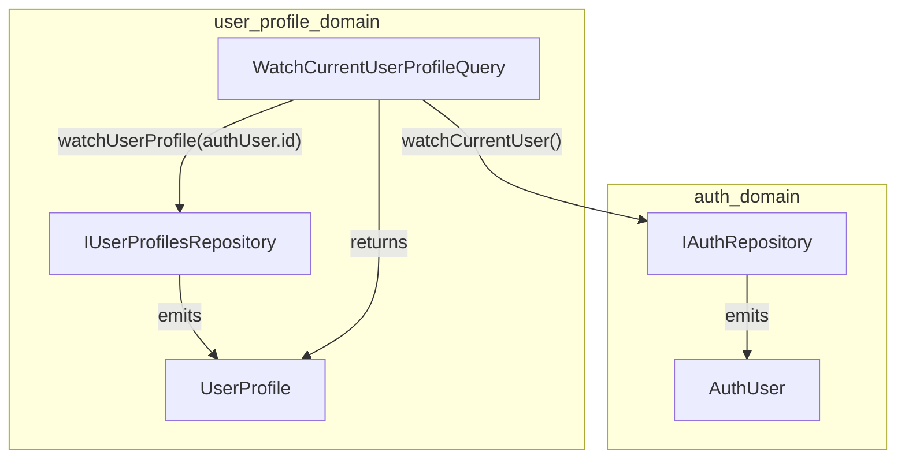
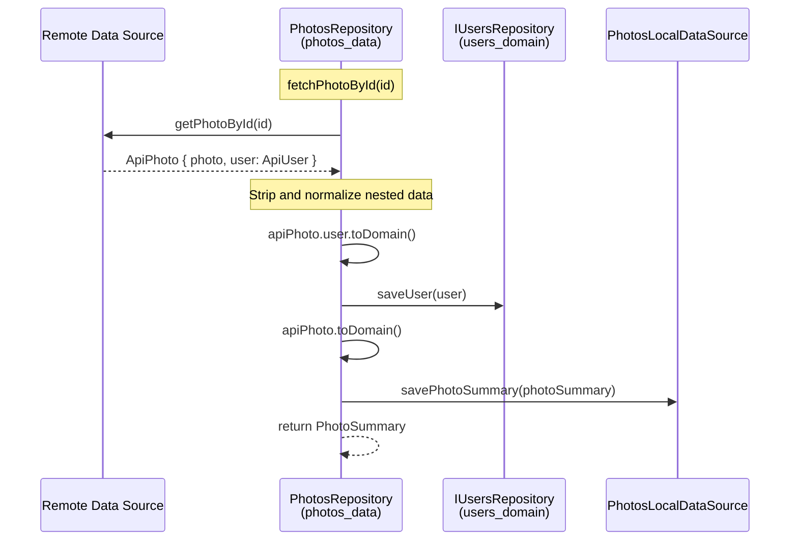

# FFCA FAQ

> Common questions about applying feature-first clean architecture.

- Source: https://engineering.verygood.ventures/architecture/ffca/faq/

---

Most of FFCA follows from the [layer rules](/architecture/ffca/domain/). However, a few situations come up often enough, and have a non-obvious answer, that they're worth writing down. These are the questions we get asked the most.

## Should we use callable classes for Commands and Queries?

No. Callable classes look great at the call site. However, they break code navigation. For example, if you try to "find all usages" of a `call` method, Dart mixes different callable classes together. If you try to jump to the `call` method, you are unable to do so unless you explicitly use `call`.

Therefore, please use the following verbs:

- **Commands** use an `execute` method.
- **Queries** use a `get` or `watch` method, depending on whether it returns a `Future` or a `Stream`.

## How do I handle auth and user profiles?

Identity, meaning authentication, and entity, such as a user profile, are two separate domains. Therefore, each should be a separate feature.



If the `Auth` feature returns a full `UserProfile` object, with bio, address, settings, and so on, you couple your authentication logic to your business data. This means every time you add a field to the user profile, such as `themePreference`, you have to modify the `Auth` feature. That breaks the single responsibility principle and the bounded contexts of each feature.

Therefore, it's recommended to split your `AuthUser` from a `UserProfile` object in different feature packages.

**`auth_domain`:**

```dart
class AuthUser {
  const AuthUser({
    required this.id,
    required this.email,
    this.isEmailVerified = false,
  });

  final String id;
  final String email;
  final bool isEmailVerified;
}

abstract interface class IAuthRepository {
  Future<AuthUser?> getCurrentUser();
  Stream<AuthUser?> watchCurrentUser();
}
```

Optionally, include minimal claims on `AuthUser` if your auth provider, such as Firebase or Auth0, gives them to you for free. Anything beyond that belongs in the profile.

**`user_profile_domain`:**

```dart
class UserProfile {
  const UserProfile({
    required this.id,
    required this.username,
    required this.avatarUrl,
  });

  final String id;
  final String username;
  final String avatarUrl;
}

abstract interface class IUserProfilesRepository {
  Future<UserProfile> getUserProfile(String userId);
  Stream<UserProfile> watchUserProfile(String userId);
}
```

In order to glue them together and return information about the current user, add a Query inside the `user_profile_domain`. This one uses `switchMap` from [rxdart](https://pub.dev/packages/rxdart):

```dart
class WatchCurrentUserProfileQuery {
  WatchCurrentUserProfileQuery({
    required IAuthRepository authRepository,
    required IUserProfilesRepository userProfilesRepository,
  })  : _authRepository = authRepository,
        _userProfilesRepository = userProfilesRepository;

  final IAuthRepository _authRepository;
  final IUserProfilesRepository _userProfilesRepository;

  Stream<UserProfile?> watch() {
    return _authRepository.watchCurrentUser().switchMap((authUser) {
      if (authUser == null) {
        // Signed out, so there is no profile to watch.
        return Stream.value(null);
      }

      // Signed in, so switch to watching this user's profile.
      return _userProfilesRepository.watchUserProfile(authUser.id);
    });
  }
}
```

Notice that the `user_profile` feature depends on `auth_domain`, and `auth` knows nothing about profiles.

## What if the backend has one large OpenAPI or Swagger definition for every endpoint?

Generate a Dart package that knows how to talk to the Swagger client in the `shared` folder. As part of the package, it should start with a Dart script in the `tool` folder. The script should:

1. Download the latest version of the OpenAPI or Swagger spec.
2. Generate the client with a package like [swagger_to_dart](https://pub.dev/packages/swagger_to_dart). It uses [Dio](https://pub.dev/packages/dio), so you get the same HTTP client as the `api_client` recipe in the [Very Good Flutter Cookbook](https://github.com/VGVentures/very_good_flutter_cookbook).
3. Export the parts each feature needs.

Each feature then uses that shared client inside its own `data` package. Given a `/products/{id}` endpoint returning an `ApiProduct` DTO, `product_data` exposes a `ProductsRepository` with a `getProductById` method that:

1. Checks whether the product is already in the local database.
2. If not, fetches it with the shared client.
3. Stores it in the database.
4. Maps the `ApiProduct` DTO to the domain `Product`.

This way, the shared package stays generic, and every product-specific decision stays in the feature.

### Dealing with nested objects

Often times, APIs will also return nested objects. For example, you might have a `Photo` object with an embedded `User`. This is a classic "normalized cache vs. nested API response" problem.

Say you want to fetch an `ApiPhoto` from the API, store the photo and the user in separate local tables, and return a `PhotoSummary` object which only contains the `userId`, not the complete `User` object.

The responsibility of normalizing data, meaning the decision to store a `User` in one table and a `Photo` in another, belongs strictly to the data layer. The domain layer shouldn't know you are normalizing your cache. It just wants a `PhotoSummary`. Therefore, rather than creating a Query to handle this logic, keep it in the `PhotosRepository`.

Here's how it works. `PhotosRepository`, in `photos_data`, depends on `IUsersRepository` from `users_domain`. This is a valid dependency, data to domain. When the API returns the nested JSON, the repository strips out the `User` data and sends it to the `IUsersRepository` before saving the `Photo`.

```dart
class PhotosRepository implements IPhotosRepository {
  PhotosRepository({
    required SwaggerRemoteDataSource remoteDataSource,
    required PhotosLocalDataSource photosLocalDataSource,
    required IUsersRepository usersRepository,
  })  : _remoteDataSource = remoteDataSource,
        _photosLocalDataSource = photosLocalDataSource,
        _usersRepository = usersRepository;

  /// The generated Swagger client from the shared folder.
  final SwaggerRemoteDataSource _remoteDataSource;

  /// The local data source, such as a Drift database.
  final PhotosLocalDataSource _photosLocalDataSource;

  /// From the users_domain feature.
  final IUsersRepository _usersRepository;

  @override
  Future<PhotoSummary> fetchPhotoById(String id) async {
    // The DTO contains an embedded user.
    final apiPhoto = await _remoteDataSource.getPhotoById(id);

    // This mapping lives in photos_data. Avoid importing it from users_data.
    // That duplicates a little code, and it keeps photos_data decoupled from
    // users_data. We trade DRY for bounded contexts here on purpose.
    final user = apiPhoto.user.toDomain();
    await _usersRepository.saveUser(user);

    // Save the photo with only the userId, as a PhotoSummary.
    final photoSummary = apiPhoto.toDomain();
    await _photosLocalDataSource.savePhotoSummary(photoSummary);

    return photoSummary;
  }
}
```


