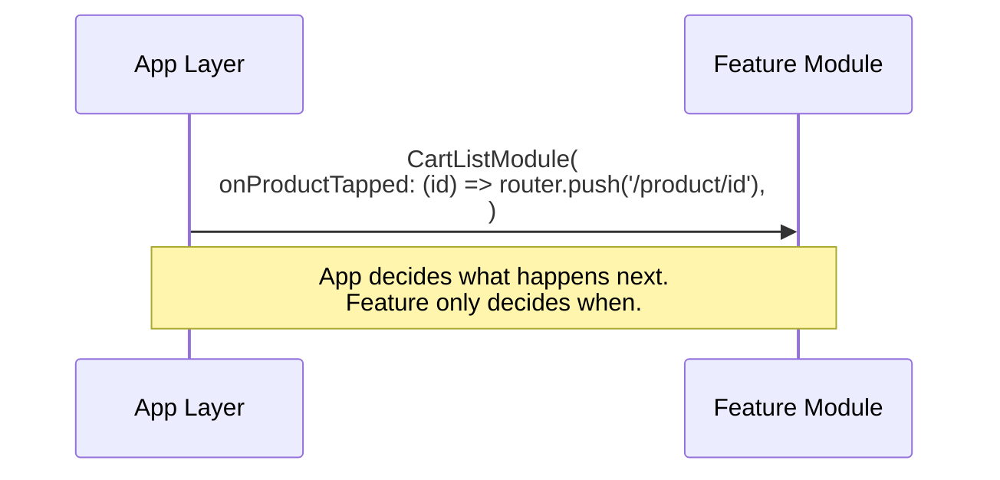
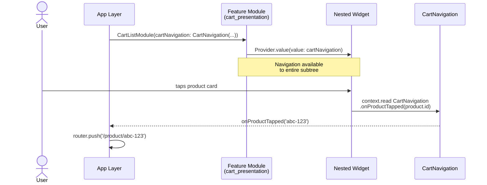

# Navigation

> How strictly isolated features navigate without importing each other's routes.

- Source: https://engineering.verygood.ventures/architecture/ffca/navigation/

---

Since features are strictly isolated, they cannot know about the application's global routing table. A feature, such as `Cart`, cannot directly import the routes of another feature, such as `Product`. This would create circular dependencies and tight coupling.

Instead, we treat navigation as a dependency.

The app layer, acting as the "assembler," is responsible for defining _what happens next_. The feature layer is responsible for detecting _when_ that action is needed. We achieve this by injecting navigation callbacks into the feature module.

## Simple features: pass callbacks directly

For features with shallow widget trees, pass the callbacks directly into the module's constructor, passing them further down the widget tree where they are needed.

```dart
// The app layer assembles the feature. Repository arguments are omitted here
// to keep the focus on navigation.
CartListModule(
  id: cartId,
  // The app decides that tapping a product navigates to the product route.
  onProductTapped: (id) => router.push('/product/$id'),
  onCheckoutStarted: () => router.push('/checkout'),
);
```



## Deep trees: define a navigation interface

For features with deep widget trees, passing callbacks down multiple constructors is tedious. Instead, define a **navigation interface** for your feature.

First, create a pure Dart class in your feature's presentation layer that defines all possible navigation actions:

```dart
class CartNavigation {
  CartNavigation({
    required this.onProductTapped,
    required this.onCheckoutStarted,
  });

  final void Function(String productId) onProductTapped;
  final VoidCallback onCheckoutStarted;
}
```

Next, require these actions in your feature module and provide them to the subtree:

```dart
class CartListModule extends StatelessWidget {
  // This variant replaces onProductTapped and onCheckoutStarted with a single
  // CartNavigation. The id and repository arguments are unchanged, and are
  // omitted here to keep the example short.
  const CartListModule({
    required this.cartNavigation,
    super.key,
  });

  final CartNavigation cartNavigation;

  @override
  Widget build(BuildContext context) {
    return Provider.value(
      // Make navigation available to every child widget.
      value: cartNavigation,
      child: CartListScreen(id: id),
    );
  }
}
```

Now any button, anywhere in the feature, can navigate without prop drilling:

```dart
InkWell(
  onTap: () => context.read<CartNavigation>().onProductTapped(product.id),
  child: ProductCard(product: product),
)
```



## Recommended: go_router with go_router_builder

Use [go_router](https://pub.dev/packages/go_router) with [go_router_builder](https://pub.dev/packages/go_router_builder) for type-safe route classes. The app layer defines `GoRouteData` classes that instantiate feature modules with the callback wiring:

```dart
@TypedGoRoute<CartListRoute>(path: '/cart/:id')
class CartListRoute extends GoRouteData {
  const CartListRoute({required this.id});

  final String id;

  @override
  Widget build(BuildContext context, GoRouterState state) {
    return CartListModule(
      id: id,
      cartsRepository: context.read(),
      productsRepository: context.read(),
      onProductTapped: (productId) => ProductDetailRoute(id: productId).go(context),
      onCheckoutStarted: () => CheckoutRoute().go(context),
    );
  }
}
```

Two routing constraints hold this together:

- **Never** import the app's router configuration or another feature's routes from inside a feature.
- **Always** navigate through generated type-safe route classes rather than string paths.

Bad ❗️:
```dart
// The path is a string, so a renamed route fails at runtime, not at
// compile time. The feature also has to know the app's URL structure.
context.push('/product/123');
```

Good ✅:
```dart
ProductDetailRoute(id: '123').go(context);
```

For general routing guidance beyond FFCA, see [navigation](/development/ui/navigation/).

### Splitting the routing table across files

The app owns the routing table, so every feature you add lands in the same file. On a team of any size that file turns into a merge-conflict magnet, and it gets long. Therefore, give each feature's routes a file of their own.

There is one constraint on how you split it. `go_router_builder` collects every `@TypedGoRoute` it finds in a _library_ into a single generated `$appRoutes`. Routes declared in a separate library are left out of it, and the failure is quiet: the build succeeds and the routes simply do not exist. So the files have to be `part` of one library rather than separate imports.

- apps/my_app/lib/app_router/
  - routes.dart the library: imports, part directives, root route
  - favorites_routes.dart part
  - ideas_routes.dart part
  - routes.g.dart generated part

`routes.dart` holds the imports, the `part` directives, and the root route:

```dart
/// The app's routing table.
///
/// Every feature is imported with a `deferred as` prefix, so its code is
/// fetched the first time a route needs it instead of shipping in the initial
/// bundle. That is what splits the web build into per-screen chunks and what
/// allows Android dynamic feature modules.
///
/// Where a feature exposes subfeature barrels, the import names one screen
/// rather than the whole package, so opening the favorites list does not also
/// download the details screen.
library;

import 'package:favorites_presentation/favorites_list.dart'
    deferred as favorites_list;
import 'package:ideas_presentation/ideas_presentation.dart' deferred as ideas;

// The branches live in their own files for readability, but they must stay
// part of this library, or go_router_builder will not collect them.
part 'favorites_routes.dart';
part 'ideas_routes.dart';
part 'routes.g.dart';

@TypedStatefulShellRoute<AppShellRouteData>(
  branches: [ideasBranch, favoritesBranch],
)
class AppShellRouteData extends StatefulShellRouteData {
  const AppShellRouteData();

  @override
  Widget builder(
    BuildContext context,
    GoRouterState state,
    StatefulNavigationShell navigationShell,
  ) {
    return ResponsiveScaffold(navigationShell: navigationShell);
  }
}
```

Each feature's branch then lives in its own part file, holding the route classes that wire its modules:

```dart
part of 'routes.dart';

const favoritesBranch = TypedStatefulShellBranch<FavoritesBranch>(
  routes: [
    TypedGoRoute<FavoritesListRoute>(
      path: '/favorites',
      routes: [
        TypedGoRoute<FavoriteDetailsRoute>(path: ':id'),
      ],
    ),
  ],
);

class FavoritesBranch extends StatefulShellBranchData {
  const FavoritesBranch();
}

class FavoritesListRoute extends GoRouteData with $FavoritesListRoute {
  const FavoritesListRoute();

  @override
  Widget build(BuildContext context, GoRouterState state) {
    return favorites_list.FavoritesListModule(
      favoritesRepository: context.read(),
      // The feature reports that a row was tapped. The app decides that this
      // means navigation, which is what lets favorites_presentation stay
      // unaware of the routing table.
      onFavoriteTapped: (id) => FavoriteDetailsRoute(id: id).go(context),
    );
  }
}
```

Because part files share the library's imports, every import stays in `routes.dart`. Adding a feature means two lines there, its deferred import and its `part` directive, and then a new file nobody else is editing. Those two lines are the only shared surface left, so conflicts are rare and trivial to resolve when they do happen.

Centralizing the imports pays off a second time, because it is also where the [subfeature barrels](/architecture/ffca/presentation/#subfeature-barrel-files) get their `deferred as` prefixes. You can see the whole thing wired up in the [`app_router` of the mealify feature-first app](https://github.com/VGVentures/mealify_feature_first/tree/main/apps/mealify_app/lib/app_router).

## Deep links and data hydration

Screens must always be rebuildable from URL parameters alone. When navigating within the app, an `$extra` object can be passed to skip a loading state. However, `$extra` is volatile, and is lost on browser refresh, process death, or cold-start deep links. Therefore, every screen must handle it being null:

```dart
@TypedGoRoute<ProductDetailRoute>(path: '/product/:id')
class ProductDetailRoute extends GoRouteData {
  const ProductDetailRoute({required this.id, this.$extra});

  final String id;

  /// A performance optimization. May be null on a cold start or refresh.
  final Product? $extra;

  @override
  Widget build(BuildContext context, GoRouterState state) {
    return ProductDetailModule(
      productId: id,
      initialProduct: $extra,
    );
  }
}
```

The bloc checks if `initialProduct` is available. If so, it emits `Loaded` immediately. If not, it fetches by `productId` and shows a loading state.

Since a module is a self-contained entry point with explicit dependencies, you can also embed it in a native host app. See [add-to-app support](/architecture/ffca/project_structure/#add-to-app-support).

## Visual extension points

The same inversion applies to widgets. A feature can declare a slot for a widget it doesn't own and let the app fill it, in the same way it declares a callback for a destination it doesn't own. See [widgets that own state](/architecture/ffca/presentation/#widgets-that-own-state).
