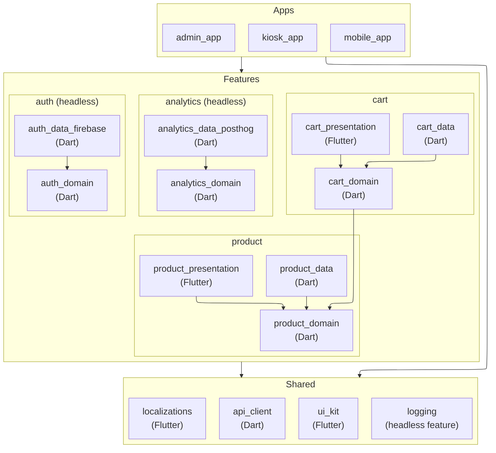
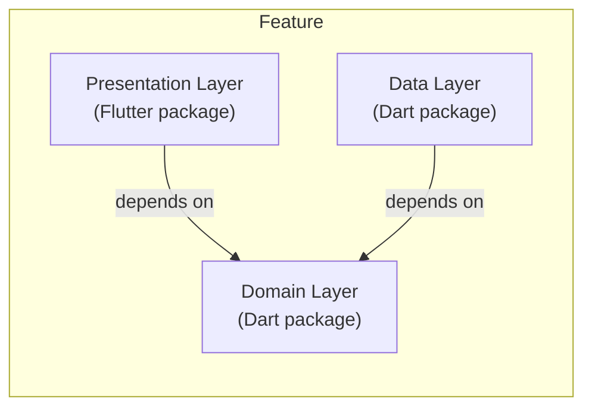

# Feature-First Clean Architecture

> An architecture for Flutter monorepos where features are packages that apps compose.

- Source: https://engineering.verygood.ventures/architecture/ffca/overview/

---

Feature-First Clean Architecture (FFCA) is our AI-ready monorepo architecture for Flutter. Every feature is a small set of Dart and Flutter packages, and your apps compose those features into something you can ship.

Why go to the trouble of making each layer a separate package, rather than a folder? Because a package boundary is enforced for you. If the cart feature isn't allowed to reach into the product feature's data layer, then that package isn't in its `pubspec.yaml`, and the analyzer will say so before a reviewer has to. Furthermore, well-bounded packages give AI agents a deterministic target to write into, which reduces errors and makes their output consistent regardless of the model or the prompt.

## Goals

FFCA is designed to:

- Give AI agents deterministic targets, so their output stays consistent regardless of model or prompt.
- Enable teams to ship features independently, without waiting on other teams.
- Establish ownership models for shared code.
- Allow features to be reused in different apps. For example, you could build a feature and use it for a _point of sale_ app, a _mobile_ app, and an _admin_ app.
- Reduce friction when multiple teams touch the same codebase.
- Address a couple of shortcomings we've hit with our other architectural approaches, namely multiple blocs needing to perform the same data transformations, and the difficulty of sharing functionality across different blocs.

:::tip[Which architecture should you reach for?]
This architecture is designed for Flutter projects using AI-assisted development, monorepos with multiple apps sharing features, teams organized around feature ownership, projects where features need to be added or removed per app, and codebases that need to scale predictably.

Consider our standard [layered architecture](/architecture/architecture/) when you have a single app with fewer than three features, when you're not using AI-assisted development and the package overhead isn't justified, or when features will never be shared across apps or teams.

That said, if you're using AI tools, the package overhead is near-zero, because the AI generates it. The structural boundaries also improve AI output quality. Therefore, consider starting with FFCA even for smaller projects.
:::

## The structure

Each project contains three major parts in a monorepo workspace: **apps**, **features**, and **shared libraries**. Apps depend on features and shared libraries, features depend on shared libraries, and nothing depends on an app.

### Apps

Apps are the deployable applications. In a large codebase, you might have several of them, such as a _kiosk_ app, an _admin_ app, and a _mobile_ app.

In this architecture, the responsibility of the app is rather limited. It composes a series of features and shared libraries to build a complete, deployable artifact that your target audience can use. Each app then defines its own routing structure, environment configurations, bundle ids, and CI/CD workflows for verification and deployment.

### Features

A feature is a cohesive unit of functionality. Some features have screens, some don't. Every feature follows clean architecture, with domain, data, and optionally presentation layers as separate packages.

A feature with all three layers owns a user-facing flow. For example, an online store app may have a `Product` or `Cart` feature, to display a Product Screen or Shopping Cart.

#### Headless features

A feature without a presentation layer is a **headless feature**. It provides business logic and data access consumed by other features, but it owns no screens. Common examples include `auth`, `analytics`, and `user_profile`.

A headless feature can grow into a full feature by adding a presentation layer package. For example, `auth` starts as a headless feature with domain and data, and when you need a login screen, adding `auth_presentation` makes it a full feature. No structural changes to the existing packages are required.

#### Presentation-only features

A **presentation-only feature** has a presentation package and no domain or data package. It exists to compose other features' domains into a screen.

Where a headless feature has domain and data and no UI, a presentation-only feature is the opposite arrangement. All UI, and no domain of its own.

The `ideas` feature in the [mealify reference implementation](https://github.com/VGVentures/mealify_feature_first) is one. `ideas_presentation` depends on `drinks_domain`, `favorites_domain`, and `meals_domain`, and there is no `ideas_domain`.

The layout and naming don't change. It sits at `features/{name}/{name}_presentation` like any other presentation package, and the absence of siblings is the signal. Nothing needs declaring.

### Shared libraries

Applications and features may require common, shared libraries to achieve their goals. For example, many features may need a Swagger-generated `api_client` to perform HTTP requests, or a `ui_kit` (aka design system) for common widgets. Rather than each feature defining their own `api_client`, we can use a shared library across all features.

The distinction between shared libraries and features can be a bit fuzzy. A good rule of thumb: shared code should have zero knowledge of your app's features. Shared libraries never import from a feature folder, and their API makes sense without any feature-specific context. If you find yourself referencing a particular feature from shared, that code likely belongs in the feature instead.

The decision rule comes down to two questions:

- **Is it a business capability that apps compose?** Then it belongs in `features/`.
- **Could you publish it to [pub.dev](https://pub.dev) and would a stranger use it unchanged?** Then it belongs in `shared/`.

This is why business-domain packages like `auth`, `analytics`, and `user_profile` are features, often headless ones, rather than shared libraries. They represent business decisions: which auth provider to use, which analytics events to track, and what user data to store. Different apps have different backends. For example, some apps may use Firebase Auth while others use Auth0, and some apps may use Google Analytics while others use PostHog.

Infrastructure packages like `logging` and `secure_storage` can be either shared libraries, if they're generic enough for any project, or headless features, if they're customized for the project. A generic `ILogger` interface with a Sentry implementation belongs in `shared/`. A project-specific analytics setup with custom events belongs in `features/`.

| Component          | Shared? | Why                                                                     |
| ------------------ | ------- | ----------------------------------------------------------------------- |
| `PrimaryButton`    | Yes     | It is part of the brand design system, and agnostic of what it clicks.  |
| `LoginButton`      | No      | It implies a "Login" domain concept. Put it in `auth_presentation`.     |
| `DioClient`        | Yes     | It wraps generic HTTP logic, such as interceptors and timeouts.         |
| `ProductApiClient` | No      | It knows about "Products" and API endpoints. Put it in `product_data`.  |
| `formatCurrency()` | Yes     | Formats a double to a string. Generic.                                  |
| `calculateTax()`   | No      | Tax rules are volatile business logic. Put it in `cart_domain`.         |

## Feature layers

Each feature is made up of three layers: the _domain_ layer, the _data_ layer, and the _presentation_ layer, following the practices of [clean architecture](https://blog.cleancoder.com/uncle-bob/2012/08/13/the-clean-architecture.html). Each of these layers is an individual Dart or Flutter package.

- The **[domain layer](/architecture/ffca/domain/)** is the heart of the feature. It is pure Dart, and it defines your models, the business rules that operate on them, and the repository interfaces the feature needs.
- The **[data layer](/architecture/ffca/data/)** implements those repository interfaces. It owns the databases, the http clients, and the mapping from their DTOs onto your domain models.
- The **[presentation layer](/architecture/ffca/presentation/)** builds the UI, and defines the blocs that tie the domain layer to your widgets. A [headless feature](#headless-features) simply doesn't have one.

Notice which way the arrows point. Both the data layer and the presentation layer depend on the domain, and the domain depends on neither of them. Therefore, you can swap Firebase for Auth0, or rebuild a screen from scratch, without touching the rules in the middle.

## Where to go next

Now that you know how a project is laid out, here's the rest of the section, in the order the layers depend on each other:

- [Domain](/architecture/ffca/domain/) covers models, Commands and Queries, repository interfaces, and how one feature combines information from another.
- [Data](/architecture/ffca/data/) covers data sources, DTOs, and mapping them onto your domain models.
- [Presentation](/architecture/ffca/presentation/) covers modules, localizations, and subfeature barrel files.
- [Navigation](/architecture/ffca/navigation/) covers how a feature moves the user elsewhere without importing another feature's routes.
- [Project structure](/architecture/ffca/project_structure/) covers naming conventions, the folder layout, and monorepo tooling.
- [FAQ](/architecture/ffca/faq/) answers the questions that come up most often.
