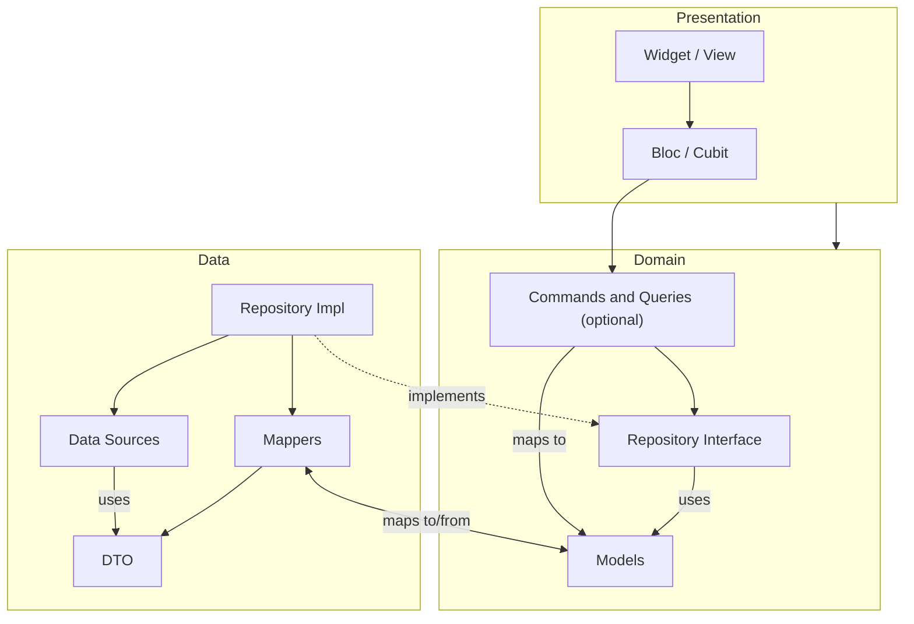

# Project Structure

> Dependency rules, naming conventions, folder layout, and monorepo tooling for an FFCA project.

- Source: https://engineering.verygood.ventures/architecture/ffca/project_structure/

---

FFCA leans heavily on convention. Package names, folder names, and the direction dependencies are allowed to flow are all fixed. Consistent structure like this enables tooling inference, AI comprehension, and mechanical validation, so you can check the shape of a project with a script rather than in code review.

## Dependency rules

Dependencies flow in one direction only. Apps depend on features and shared packages, features depend on shared packages, and nothing depends on an app. Within a feature, the domain layer sits at the bottom. The data layer imports it to implement the repository interfaces, the presentation layer imports it to render and to call into it, and the domain imports neither of them. That is what lets you swap a backend or rebuild a screen without touching the business rules.

This table is the whole rule, and it is the version a validation script implements:

| Package                  | May depend on                                                                                  |
| ------------------------ | ---------------------------------------------------------------------------------------------- |
| `{name}_app`             | any feature package, any shared package                                                        |
| `{feature}_domain`       | shared packages, other features' `_domain`                                                     |
| `{feature}_data`         | its own `_domain`, other features' `_domain`, shared packages                                  |
| `{feature}_presentation` | its own `_domain`, other features' `_domain`, other features' `_presentation`, shared packages |
| `shared`                 | external packages only                                                                         |

Two absences from that table carry as much weight as the rows themselves:

- **No presentation package depends on any `_data` package**, its own included. The app wires the data layer implementation in.
- **No shared package depends on a feature package.** A shared package depends on external packages only, which is why a widget that needs a repository cannot live in `ui_kit`.

Cycles between packages are forbidden at every layer. If two packages each need something from the other, that shared part belongs in a third package underneath both of them.

A dependency on another feature's presentation package carries two extra conditions, covered in [widgets that own state](/architecture/ffca/presentation/#widgets-that-own-state). It has to target a dedicated barrel, and the graph has to stay acyclic. That second condition is also what protects [deferred loading](#deferred-loading).



## Deferred loading

Deferred imports let an app load part of its code on demand rather than at startup. FFCA's package boundaries are what make this possible. The router imports each feature behind a `deferred as` prefix, and the compiler emits a separate chunk per feature.

This works on web builds today, and it backs Android [deferred components](https://docs.flutter.dev/perf/deferred-components). On an app that ships only to iOS and Android, the AOT snapshot contains the whole program regardless, so deferred loading gains you nothing, and this section is informational.

### The constraint

A package the app loads deferred must not also be reachable from the app through a non-deferred import path. If `product_presentation` imports `cart_presentation` eagerly, then deferring `cart` from the router achieves nothing, because `cart` is already in `product`'s chunk.

:::caution
This failure is silent. Nothing breaks, no analyzer warning fires, and the bundle stops splitting where you expected it to. That is why we state it as a rule rather than leave it to code review.
:::

### Enforcing it

Mark the deferred edges in the app's import graph, compute the set of packages reachable without crossing one, and assert that no deferred target appears in it.

Deferral is per-library rather than per-package, so a check that only parses `pubspec.yaml` catches the coarse case. Catching it at [subfeature barrel](/architecture/ffca/presentation/#subfeature-barrel-files) granularity needs the library-level import graph.

## Naming conventions

The architecture enforces naming conventions for packages. This is how tooling and AI agents can work out what a package does without opening it.

| Package                   | Convention               | Example              |
| ------------------------- | ------------------------ | -------------------- |
| Feature domain            | `{feature}_domain`       | `cart_domain`        |
| Feature data              | `{feature}_data`         | `cart_data`          |
| Feature presentation      | `{feature}_presentation` | `cart_presentation`  |
| Data with specific backend | `{feature}_data_{backend}` | `auth_data_firebase` |
| Shared package            | descriptive name         | `ui_kit`, `api_client` |

Data packages with a backend suffix, such as `auth_data_firebase`, signal the backing implementation. Swapping to `auth_data_auth0` requires no structural changes anywhere else, because everything upstream depends on `auth_domain`.

## Folder layout

- apps/
  - kiosk_app/ Flutter package
  - mobile_app/ Flutter package
  - admin_app/ Flutter package
- features/
  - product/
    - product_domain/ Dart package
      - lib/
        - models/
          - product.dart
        - repositories/
          - i_products_repository.dart
        - product_domain.dart barrel file
    - product_data/ Dart package
      - lib/
        - data_sources/
          - products_remote_data_source/
            - dtos/
              - product_dto.dart
            - products_remote_data_source.dart
        - mappers/
          - product_mapper.dart
        - repositories/
          - products_repository.dart
        - product_data.dart barrel file
    - product_presentation/ Flutter package
      - lib/
        - product_detail/
          - bloc/
          - views/
          - product_detail_module.dart
        - product_list/
          - bloc/
          - views/
          - product_list_module.dart
        - product_detail.dart subfeature barrel
        - product_list.dart subfeature barrel
        - product_presentation.dart primary barrel
  - cart/ depends on product_domain
    - cart_domain/
    - cart_data/
    - cart_presentation/
  - auth/ headless feature, no presentation
    - auth_domain/
    - auth_data_firebase/
  - analytics/ headless feature
    - analytics_domain/
    - analytics_data_posthog/
  - user_profile/ headless feature
    - user_profile_domain/
    - user_profile_data/
- shared/
  - api_client/
  - ui_kit/
  - localizations/
  - logging/ headless feature, generic enough to share
    - logging_domain/
    - logging_data_sentry/

### Layer subfolders

Each layer uses the same subfolders every time, so you always know where to look for something.

**Domain** (`{feature}_domain/lib/`):

| Folder          | Contents                                                                      |
| --------------- | ----------------------------------------------------------------------------- |
| `models/`       | Domain models, as pure Dart classes with value equality                       |
| `repositories/` | Repository interfaces, declared as `abstract interface class`                 |
| `use_cases/`    | Command and Query classes. Only needed when combining multiple repositories   |

One note on naming: the folder keeps the conventional `use_cases/` name so the layout matches other clean architecture projects, even though we [name the classes themselves](/architecture/ffca/domain/#business-rules) Command and Query.

**Data** (`{feature}_data/lib/`):

| Folder          | Contents                                                             |
| --------------- | -------------------------------------------------------------------- |
| `data_sources/` | Remote and local data sources, each with a `dtos/` subfolder         |
| `mappers/`      | Extension methods mapping DTOs and generated classes to domain models |
| `repositories/` | Concrete repository implementations                                  |

**Presentation** (`{feature}_presentation/lib/`):

| Folder                                        | Contents                                            |
| --------------------------------------------- | --------------------------------------------------- |
| `{screen_name}/bloc/`                         | `Bloc` or `Cubit`, plus state and event classes     |
| `{screen_name}/views/`                        | Screen and widget implementations                   |
| `{screen_name}/{screen_name}_module.dart`     | The module wiring dependencies for that screen      |

Each layer has a primary barrel file at the root of `lib/`, named `{feature}_{layer}.dart`, plus [subfeature barrel files](/architecture/ffca/presentation/#subfeature-barrel-files) for any entry point that should be independently importable.

## Monorepo tooling

### Dart workspaces

Utilize [Dart workspaces](https://dart.dev/tools/pub/workspaces) to manage the monorepo. This ensures all packages within the project utilize the same versions of external packages. If conflicts appear with a transitive dependency, use Dart's tooling to identify and resolve the issue.

### Running commands across packages

There are two options here. Choose whichever one makes most sense for your project or scenario:

1. **[Melos](https://melos.invertase.dev/) (recommended)**: the most widely used tool for Flutter and Dart monorepos. It handles dependency management, runs scripts across all packages, supports filtering by Dart or Flutter packages, and automates versioning and changelog generation. It works on all platforms.
2. **A `tool` folder**: if you have more intricate actions to perform, such as fetching localizations from a service for multiple feature packages, consider writing a Dart program inside a `tool` folder. See Dart's [package layout conventions](https://dart.dev/tools/pub/package-layout) page for more information.

## Add-to-app support

FFCA's feature isolation maps naturally to Flutter's [add-to-app](https://docs.flutter.dev/add-to-app) pattern. Each feature's [module](/architecture/ffca/presentation/#the-module) is a self-contained entry point with explicit dependencies, making it embeddable in a native host app.

The module takes its dependencies as constructor parameters, wires its own provider tree, and communicates outward through navigation callbacks. In a full FFCA app, the app layer instantiates the module inside a `GoRouteData.build()`. In add-to-app, the module is instantiated directly as the root widget of a `FlutterEngine`. The module code is identical. The only difference is what the callbacks target, go_router routes or platform channels.

```dart
@pragma('vm:entry-point')
void cartEntryPoint(String cartId) {
  final apiClient = ApiClient(baseUrl: 'https://api.example.com');
  final cartsRepository = CartsRepository(apiClient: apiClient);
  final productsRepository = ProductsRepository(apiClient: apiClient);

  const channel = MethodChannel('com.app/navigation');

  runApp(
    MaterialApp(
      home: CartListModule(
        id: cartId,
        cartsRepository: cartsRepository,
        productsRepository: productsRepository,
        // Hand control back to native through a platform channel.
        onProductTapped: (productId) =>
            channel.invokeMethod('showProduct', {'id': productId}),
        onCheckoutStarted: () => channel.invokeMethod('showCheckout'),
      ),
    ),
  );
}
```

Subfeature barrels enable granular embedding. A native app can embed just one screen from a feature, via its subfeature barrel, without pulling in the entire feature, minimizing Flutter binary size.
